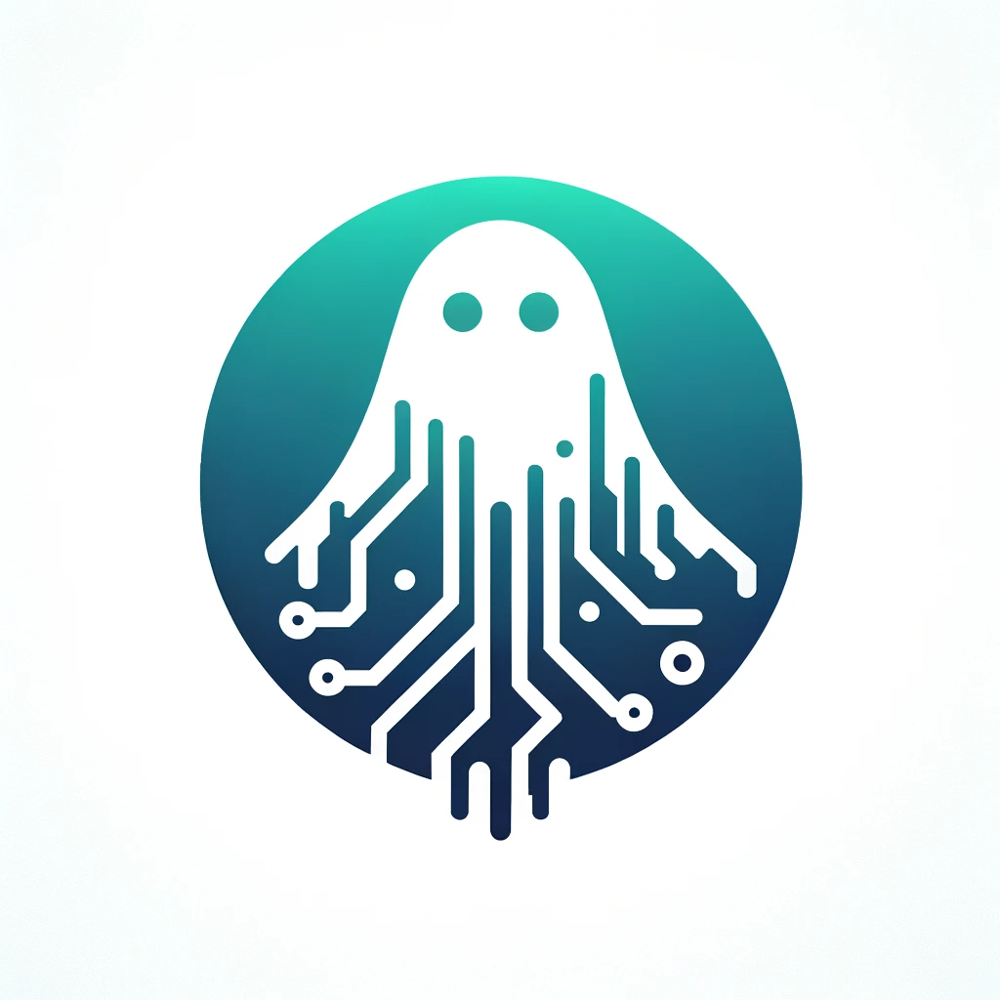

# dETHlegacy

  

The project is a blockchain-based system designed for managing digital assets after a user's death. Its core purpose is to ensure that digital assets are securely and accurately distributed according to the wishes of the deceased.

## Contracts

| Network | Address |
| --------------- | --------------- |
| Goerli   | [0x9c839e5f2843fbd24b07832563a3e457daa8c37f](https://goerli.etherscan.io/address/0x9c839e5f2843fbd24b07832563a3e457daa8c37f)  |
|  Base Goerli | [0x3D7BeAb78e1Cd9f13E131d4e3724Cb9B03f91256](https://goerli.basescan.org/address/0x3d7beab78e1cd9f13e131d4e3724cb9b03f91256) |

## Features

- Token Selection & Percentage for Wills
- Secure Hash Creation Using Personal Info 
- Contract Signing with Multi-Signature (SAFE)
- Verification Process & Fees (UMA)
- Death Certificate Storage (IPFS)
- Donations (UNICEF)

## Technologies Used

Ethereum
WalletConnect
UMA
IPFS
SAFE
